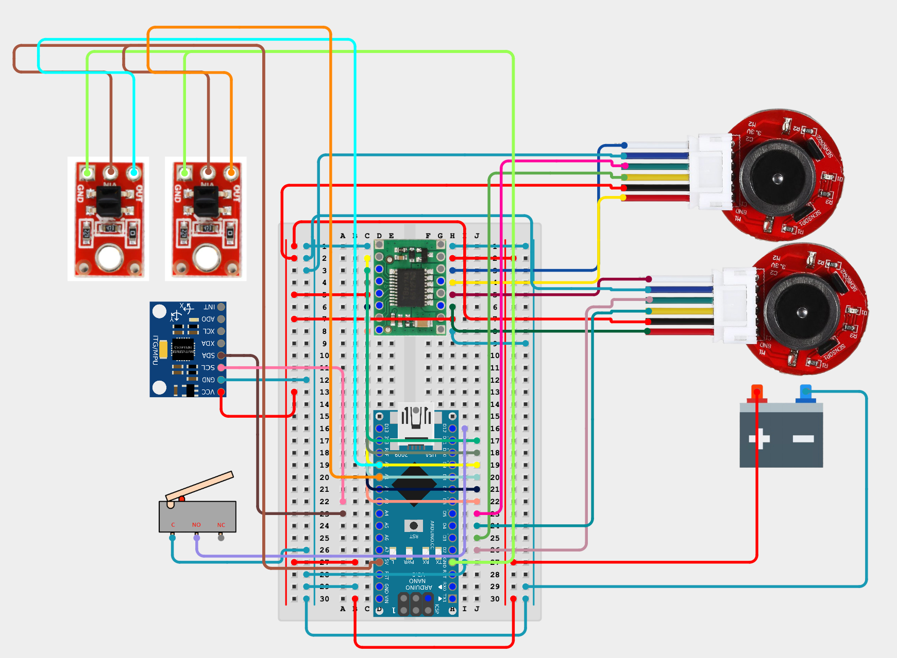
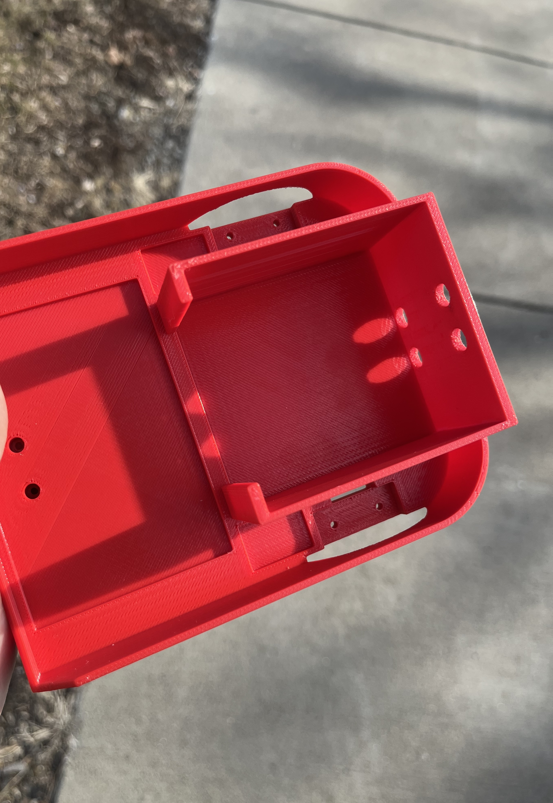
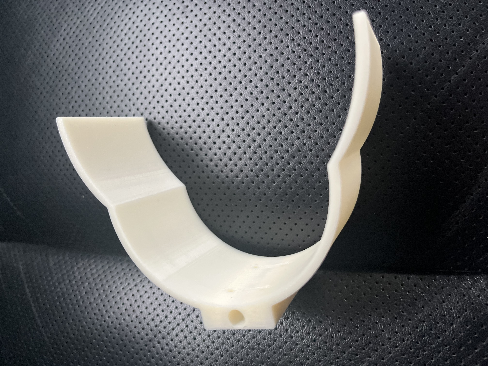
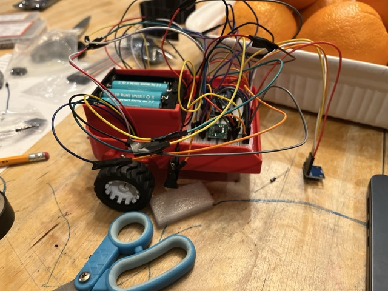
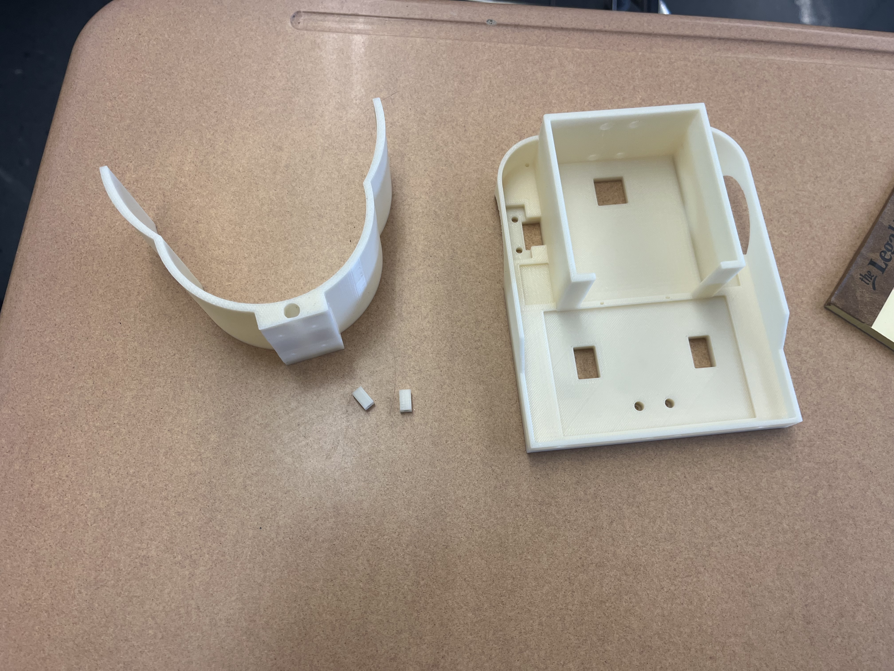
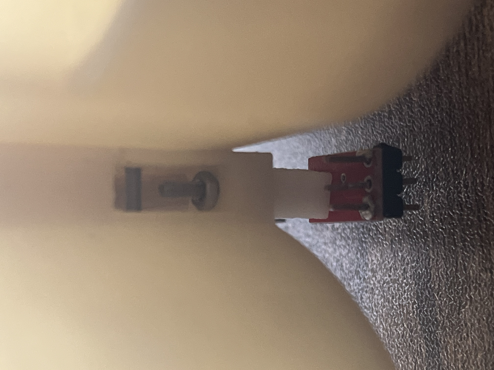
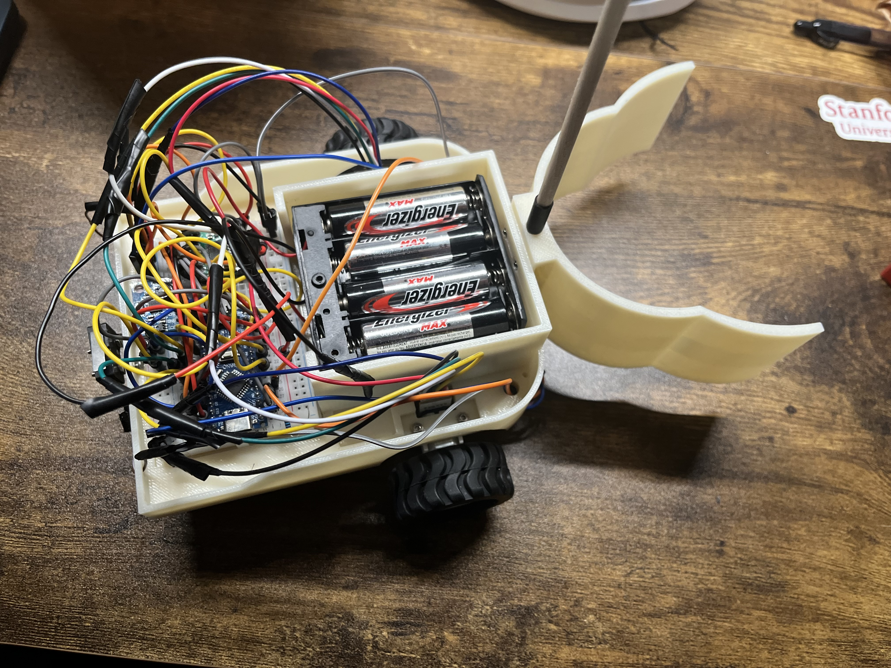

# pasta-bot
A two-wheeled autonomous ground vehicle made for Science Olympiad's Robot Tour event, affectionately referred to as **pasta-bot** because of the spaghetti code holding it together.

  

## About This Project
Created for educational purposes as a first attempt at a hardware project.

**no pre-built kits** were utilized in the making of this robot. Robot design, construction, material sourcing and programming were conducted independently. **OnShape** was used as CAD software of choice to design and 3D print custom parts for the robot. Specific materials utilized are listed in a section below.

Credit to Max Ignatenko for the [PID_V2 Arduino Library](https://docs.arduino.cc/libraries/pid_v2/), and the excellent blog at [TopFinishKits](https://topfinishkits.com/science-olympiad-blog/) that thoroughly explained PID concepts and steering mechanisms that inspired the creation of this vehicle. Finally, many thanks to our high school tech department for allowing the use of their 3D printers.

### A Brief overview of Robot Tour
The goal of the Robot Tour event is to guide a robot as close to a target point and target time as possible, all while avoiding obstacles.
  - Competitors are given the course setup (i.e. where the obstacles are, bonus gates, water bottle locations, start & end point) and target time only at the competition
    - Note: participants must plan the navigation paths **themselves** at the competition, pathfinding algorithms are strictly forbidden
  - Accessing special zones and pushing water bottles into these zones yield bonus
    - Note: only pushing is allowed, mechanisms such of those using **servos** are strictly banned
  - Harsh penalty for knocking over obstacle
  - Additional information can be seen on the [scoring sheet](https://www.soinc.org/sites/default/files/uploaded_files/RobotTourBC2026TeamChecklist_vB.pdf)

## Code Logic
**Due to** the fact that course information is not available until day of competition, we opted to hard code values for total dist of path chosen and target time, changing them only based on the information given at the time of competition. 

Given these constraints, the robot adjusts its own speed across the course to execute its route with perfect timing. Since motors have no conception of velocity, however, **PID** control loop using motor encoder data was used to control voltage supplied into motor driver pins, where physical constants (i.e. wheel diameter) translate encoder ticks into data interpretable in a physical context.

Basic kinematics was used in this timing-velocity calculation, as the robot necessitates time to accelerate into the ideal velocity, thereby affecting velocity calculations. The calculation therefore takes into account the trapezoidal acceleration profile implemented in the driving logic of the  vehicle and dynamically adjusts necessary speed across against its own timer every leg to account and adjust for errors.

Turning mechanism was solely dictated by IMU readings with a slight head room for angle errors. An attempt to use wheel-encoder data either as replacement or complement (through 1D Kalman sensor fusion technique) revealed that the wheel-encoder data is unfit for rotations in the robot, thereby poisoning the mostly accurate IMU readings robot (especially due to the small size of the bot).

A feed forward mechanism was implemented to supplement the PID control loop, derived from manual experiments in approximating the relationship between power supplied with wheel-encoder tick readings on floor. PID tunings were also adjusted using constants through empirical evidence.

Additional code implementations (such as addressing coasting after braking) can be found in the **src code in **this repo****

## Hardware Design
The robot was designed with the need to minimize its size in mind, because its rotational and translational movements can be controlled more precisely due to its size. As consequence, the design of chassis required careful planning. Below are a few decisions and their justifications:
- Since the battery compartment is the heaviest, trials in OnShape was conducted before 3D printing to assess center of mass locations. The current positioning of nearing the front of the robot was found to be optimal for placing center of mass only slightly behind wheel axis, which was believed to be optimal.
    - Additionally, quarters can be simply taped to the bottom-back portion of the robot to manually tune center of mass back towards the ball cast if the above belief is erroneous
- Many cutouts were made for wiring access on the robot platform in order to avoid tangling and potential loosening issues
- QTR-1A sensor implemented in the second iteration of the robot was placed directly under the claw as it has an optimal sensing range of only 3mm, so it was placed extremely close to the ground while remaining parallel about the dowel so it could stop the bot as soon as it detects drastic color change (i.e. finish line tape)
  
### Circuit Wiring Diagram
Generated from [app.cirkitdesigner.com](https://app.cirkitdesigner.com)

### Materials
The Robot is constructed of 3D printed parts and generic parts easily purchasable in a hardware store or on Amazon. Below is a list of parts, linked to the specific versions purchased:
- Generic Male to Female Jumper Wires
- Generic Resistors
- Generic Capacitors
- Screws, washers and nuts of varying sizes (typically M2 screws)
- [2 4xAA battery holders](https://www.robotshop.com/products/4xaa-square-battery-holder-cover?variant=42358869459105&_su_rec=S17PI5AEgwTpNsuvNKlW1rqhvabVbw8g5e13q2zOxe7W873Ys7yY6pqnl9lSvcfFUGskWgP7lXcEQf_UOMak9XEBB1iMBy8KXxyLFmyz57ed-U23psTKX2QvNrC5OoK8fxiplUgRZesnxPGodI2CcQzoPec2ozPmhRfiS2n-hyhX8kgJMkNVawErQimOiVVbyNozE56mSrHto66yEFHbzTwwj9JDxRMN7SNziesx8NpGkbRZQ_SCjhyVS4YVUJBV&_su_rec_id=1774f2ee-6c89-48f2-87f8-4a16649cea9c-1786041676)
- [2x Wheels (opted for 42x19mm in dim)](https://www.robotshop.com/products/pololu-1090-wheel?variant=42360958484641)
- [Ball Caster with 3/8” Metal Ball](https://www.robotshop.com/products/pololu-ball-caster-3-8-in-metal-ball?variant=42359847649441)
- [Micro Limit Switch (Straight Lever)](https://www.robotshop.com/products/servocity-micro-limit-switch-straight-lever-2-pack?variant=44598088925345)
- [Generic MPU-5060 accelerometer/gyroscope for Arduino](https://www.amazon.com/HiLetgo-MPU-6050-Accelerometer-Gyroscope-Converter/dp/B00LP25V1A?th=1)
- [TB6612FNG DC Motor Driver](https://www.robotshop.com/products/pololu-dual-dc-motor-driver-1a-4-5v-3-5v-tb6612fng?variant=42358386524321)
- [Arduino Nano w/ USB-C Port (opted for a clone)](https://www.amazon.com/LAFVIN-Board-ATmega328P-Micro-Controller-Arduino/dp/B07G99NNXL/ref=sr_1_4?s=industrial)
- [Generic N20 Motors 12V 200 RPM with encoders attached](https://www.amazon.com/MECCANIXITY-Encoder-Gearbox-Electric-Reduction/dp/B0F8NGMRCX/ref=sr_1_3?s=industrial&th=1)
- [N20 Motor Mount Bracket (easily 3D Printable)](https://www.amazon.com/MECCANIXITY-Mounting-Bracket-11-5mm-Screws/dp/B09NN6FQ78/ref=sr_1_4?s=industrial)
- [2x Pololu QTR-1A IR Sensor (optional)](https://www.robotshop.com/products/pololu-qtr-1a-reflectance-sensor-2pk?)
- Robot Chassis (STL provided in this repo)
- Spacers for Ball cast/QTR sensors (STL provided in this repo)
- Claw (STL provided in this repo)
- Alignment tool for lining up the robot straight (STL provided in this repo)
## Thoughts
While this vehicle was not perfect by all means, this project allowed me to learn about invaluable skills not yet covered through school, namely **CAD**, **elements of circuit design**, **exposure to engineering concepts**. As consequence, I am excited to keep learning, building and challenging myself with future projects :).

## Media
**V1 Chassis Print**

**V1 Claw Print**

**Construction of V1 Robot**

**Demo of V1 Bot**

**V2 (with IR sensor) Prints**

**Improved Claw Attachment Mechanism w/ IR attachment**

**Finished Re-construction of Robot w/ Changes**

